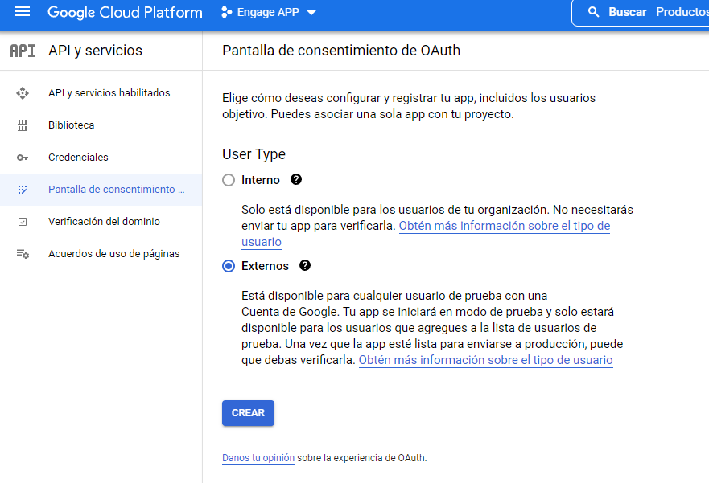
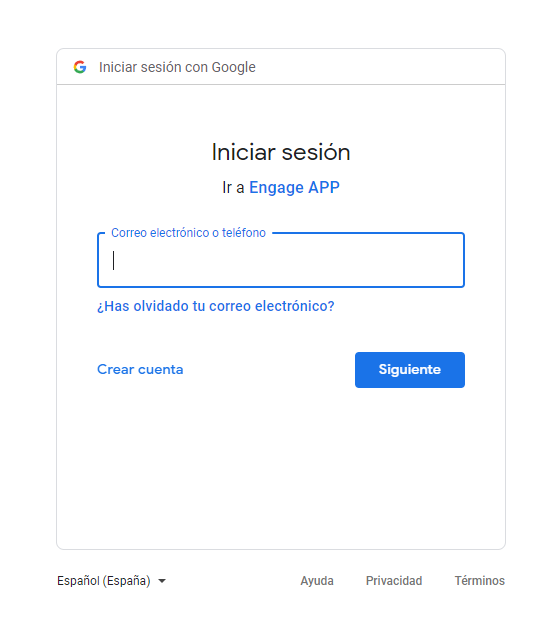

***Tutorial OAuth Gmail***

> **Registrar la aplicación en Google Devs:**
>
> Ir a
> [https://console.cloud.google.com/](https://console.cloud.google.com/)
>
> Crear un proyecto Nuevo:
>
> 
>
> 
>
> Con el proyecto ya creado, en el menú izquierdo nos dirigimos a: **API
> y Servicios -\> Credenciales.**
>
> 
>
> Seleccionamos el proyecto creado:
>
> 
>
> Vamos a Pantalla de consentimiento y configuramos el UserType como
> **Externos** y le damos a CREAR.
>
> 
> 
> En las siguientes pantallas se rellenan los campos necesarios:
>
> 
>
> 
>
> Le damos a GUARDAR Y CONTINUAR, nos envía a una pantalla de permisos,
> le damos nuevamente GUARDAR Y CONTINUAR sin modificar nada.
>
> 
>
> En la siguiente pantalla agregaremos los usuarios de prueba (el / los
> usuarios que conectaran con Gmail) ya que el estado de la aplicación
> será de "Prueba" todavia:
>
> 
>
> Le damos GUARDAR Y CONTINUAR luego de agregar los usuarios, nos
> enviara a un resumen de lo configurado:
>
> 
>
> Bien, ahora crearemos las credenciales, para ello vamos a: Crear
> credenciales -\> ID cliente de OAuth
>
> 
>
> Elegimos el tipo de aplicación y le damos crear:
>
> 
>
> Se generarán las claves, las copiamos y guardamos para luego
> utilizarlas en el codigo:
>
> 
>
> Bien, a esta altura deberíamos tener 3 datos que utilizaremos
> próximamente:

-   **El / Los usuarios autorizados que conectaran desde nuestra app con
    > Gmail.**

-   **El KEY ID de cliente.**

-   **El KEY Secreto de cliente.**

> **[Cargar estos codigos en el codigo de la aplicación:]**
>
> En la Clase Mail.vb\
> \
> Debemos cargar la cuenta de Gmail autorizada en el campo "
> GmailAccount "
>
> La KEY ID de cliente en el campo " ClientId "
>
> y El KEY Secreto de cliente en el campo "ClientSecret"
>
> 
>
> Al ejecutar la aplicación, seremos enviados a la web de Gmail para
> loguearnos con la cuenta autorizada y permitir el acceso a la misma
> desde nuestra aplicación:
>
> 
>
> Luego de loguearnos nos avisara que la APP esta en prueba:
>
> 
>
> Le damos continuar y nos pedira permisos sobre la casilla para poder
> enviar, recibir, etc:
>
> 
>
> Luego de continuar, nos avisara que la aplicación recibe el Token
> correctamente:
>
> 
>
> Ya podemos cerrar el navegador, nuestra APP se encuentra conectada con
> Gmail.
